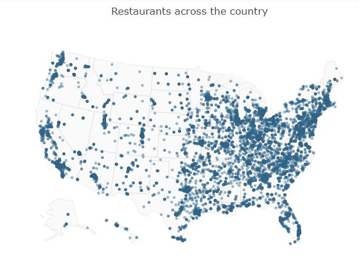
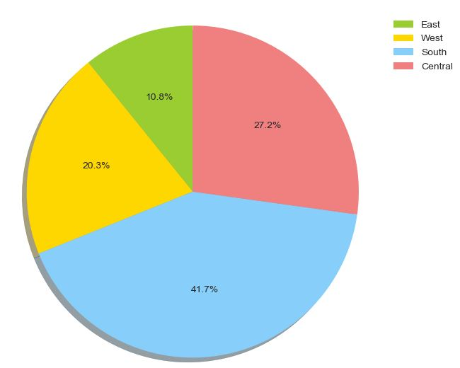
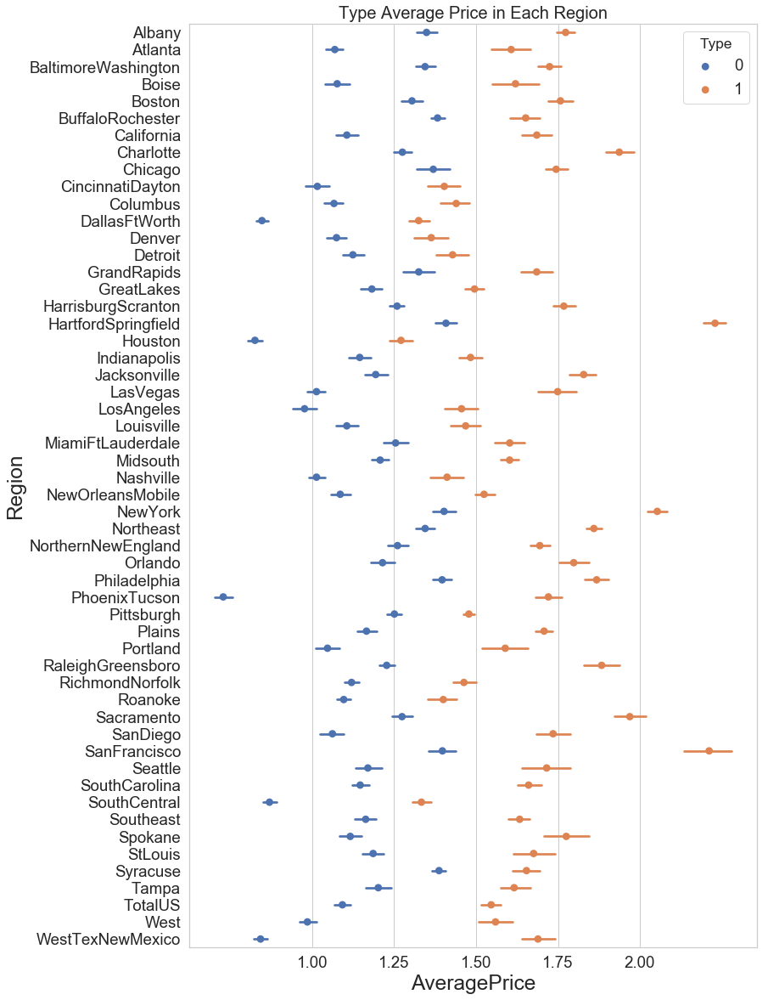
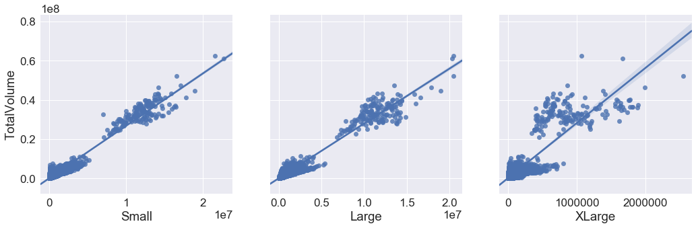
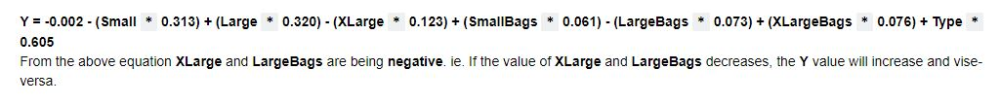
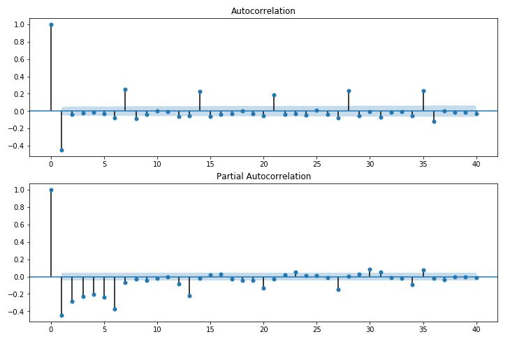

# Machine Learning

Machine Learning is the field of study that gives computers the capability to learn without being explicitly programmed. ML is one of the most exciting technologies that one would have ever come across. 
Machine Learning : __The ability to learn.__

### Repository Overview

This repository is about different Machine Learning algorithm approaches as per the industry practices.

### Project

1. Fast Food Restaurants data analysis
2. Avocado data price prediction
3. Sales store item forecast
4. Letter Recognition

### 1. Fast Food Restaurants data analysis

<b>Problem Statement</b> 
The Fast Food Restaurants dataset we are analyzing and providing Ranking of Top City having Fast Food Restaurants in United States of America 

<b>Introduction</b> 
In the Exploratory Data Analysis we are using Python skills on a structured data set including loading, inspecting, wrangling, exploring, and drawing conclusions from data. The notebook has observations with each step in order to explain thoroughly how to approach the data set. Based on the observation some questions also are answered in the notebook for the reference though not all of them are explored in the analysis. 

#### 
Data
| COLUMN | DATA TYPES |
| --- | --- |
| `ADDRESS`    |    OBJECT|
| `CITY`       |    OBJECT|
| `COUNTRY`    |    OBJECT|
| `KEYS`       |    OBJECT|
| `LATITUDE`   |    FLOAT64|
| `LONGITUDE`  |    FLOAT64|
| `NAME`       |    OBJECT|
| `POSTALCODE` |    OBJECT|
| `PROVINCE`   |    OBJECT|
| `WEBSITES`   |    OBJECT|

<b>Observations</b> 
* Name : We found there are spelling mistakes(upper, lower and punctuation) on name column, we can group similar names.
* Keys : We noticed keys include country, province, city and address were present, all keys are considered as unique.
* Websites : We have 465 websites missing. 
Other than Websites we don't have any missing data.
* Standardize all column headers to lower case (to prevent typos!)
* Divided our data into 4 Zones with respect to province. 
East_zone = ["CT", "MA", "ME", "NH", "NJ", "NY", "PA", "RI", "VT", "Co Spgs"] 
West_zone = ["AK", "AZ", "CA", "CO", "HI", "ID", "MT", "NM", "NV", "OR", "UT", "WA", "WY"] 
South_zone = ["AL", "AR", "DC", "DE", "FL", "GA", "KY", "LA", "MD", "MS", "NC", "OK", "SC", "TN", "TX", "VA", "WV"] 
Central_zone = ["IA", "IL", "IN", "KS", "MI", "MN", "MO", "ND", "NE", "OH", "SD", "WI"] 

<b>Conclusion</b> 
* The Fast Food Restaurant Survey being conducted in US to helps and understand the place where the Fast food is highly consumed. By removing the punctuation on Name column we came to know that Mc Donald's count being the highest.
* Cincinnati City in Ohio being the Top ranking in US having highest number of restaurants.
* CA (California) state being the Top ranking in US having highest number of restaurants.TX (Texas) being the second highest in US, both states come under range of 600 - 700 restaurants count.
* McDonalds being the Top ranking in US having highest number of fast food restaurants, count is 2105. Burger King being the second highest in US, restaurant count is 1154.
* If we compare 4 Zones in US, South Zone being the Top ranking in US having highest number of fast food restaurants 41.7%. East Zone having 10.8% Fast Food restaurant in US, they are less eating Fast Food people rather than South Zone.
[Notebook](EDA_RestaurantData.ipynb)
----------------------------------------------------------------

### 2. Avocado data price prediction

<b>Problem Statement</b> 
The Avocado dataset we are classifying Organic & Conventional Type and prediting the Average price using Regression model from year 2015, 2016, 2017 and 2018 data.   

<b>Introduction</b> 
The Avocado dataset includes consumption of fruit in different regions of USA from 2015 till 2018 years of data.
We have two types of Avocado available
* Organic (Healthy)
* Conventional

### 
Data
| COLUMN | DATA TYPES |
| --- | --- |
| `DATE`            |   OBJECT |
| `AVERAGEPRICE`    |   FLOAT64 | 
| `TOTALVOLUME`     |   FLOAT64 |
| `SMALL`           |   FLOAT64 |
| `LARGE`           |   FLOAT64 |
| `XLARGE`          |   FLOAT64 |
| `TOTALBAGS`       |   FLOAT64 |
| `SMALLBAGS`       |   FLOAT64 |
| `LARGEBAGS`       |   FLOAT64 |
| `XLARGEBAGS`      |   FLOAT64 |
| `TYPE`            |   OBJECT |
| `YEAR`            |   INT64 |
| `REGION`	         |   OBJECT |

<b>Observations</b> 
* There is a strong co-relation between TotalVolume Vs Small and TotalBags Vs SmallBags.
* We can say weak co-relation between TotalVolume Vs XLarge and TotalBags Vs XLargeBags.
* Large and LargeBags comes in the middle.

<b>Conclusion</b> 
* Columns like Type of avocado, size and bags have impact on Average Price, __lesser the RMSE value__ accurate the model is, when we consider Small Hass in Small Bags.
* __Random forest Classifier__ has more accuracy than __Logistic regression__ model for this dataset , __accuracy is 0.99__ it may also denote it is overfitting as it even classifies the outliers perfectly.
* __Random forest classifier__ model predicts the type of Avocado more accurately than __Logistic regression__ model.
* __Random Forest Regressor__ model predicts the average price more accurately than __Linear regression__ model. 

[Notebook](AvocadoDataset.ipynb)

------------------------------------------------------------------

### 3. Sales store item forecast

<b>Objective</b> 
* Build a model to forecast the sales in store.
* The data is classified in date/time and the store, item and sales.

.png)

### 
Data
| COLUMN | DATA TYPES |
| --- | --- |
| `DATE`     |   OBJECT |
| `STORE`    |   INT64 |
| `ITEM`    |   INT64 |
| `SALES`    |   INT64 |

.png)

.png)

<b>Conclusion</b>
* We have used __Sales 1 : Items 1__ data for forecasting.
* Used ARIMA model to predict best p, q, d values ie, __ARIMA(6, 0, 1) AIC=601.196__
* With the help of __ACF__ and __PACF__ plotting monitored in __Autocorrelation graph and Partial Autocorrelation graph at every 7 point__ we can see recurring pattern. 

[Notebook](ARIMAmodelProject.ipynb)

------------------------------------------------------------------

### 4. Sales store item forecast

<b>Objective</b> 
The objective is to identify each of a large number of black-and-white rectangular pixel displays as one of the 26 capital letters in the English alphabet.
